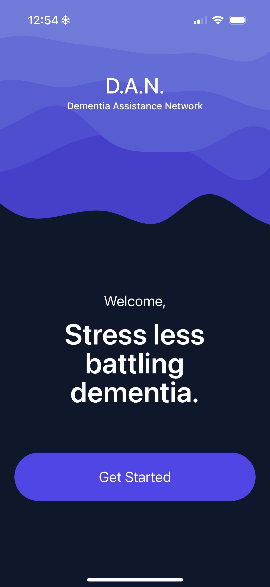
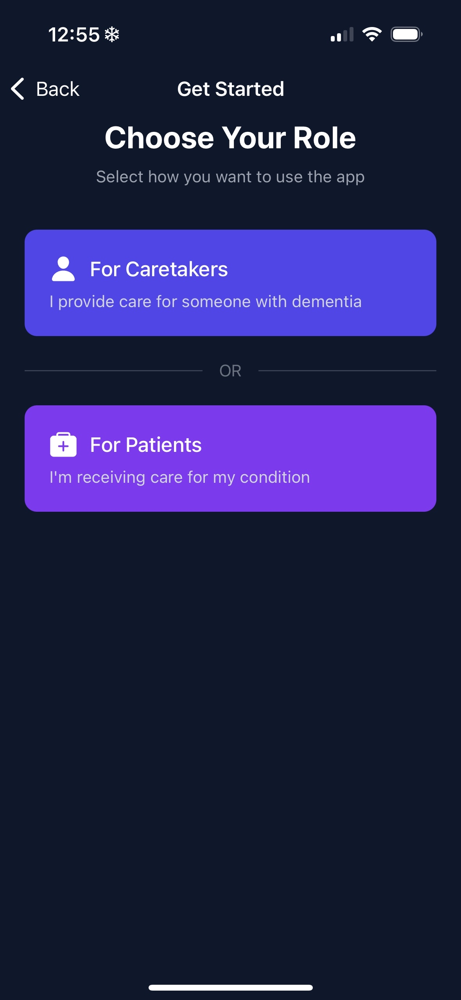
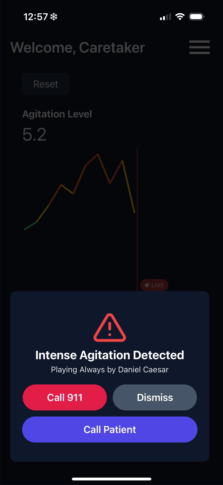
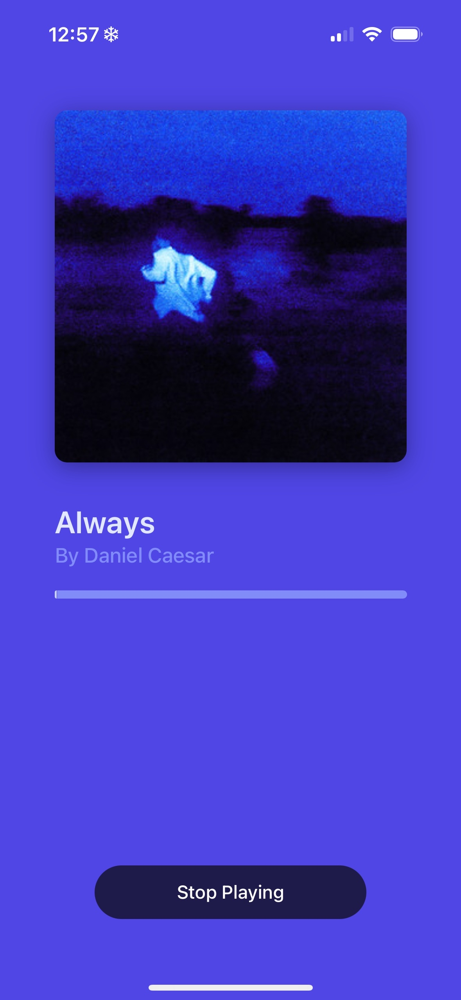
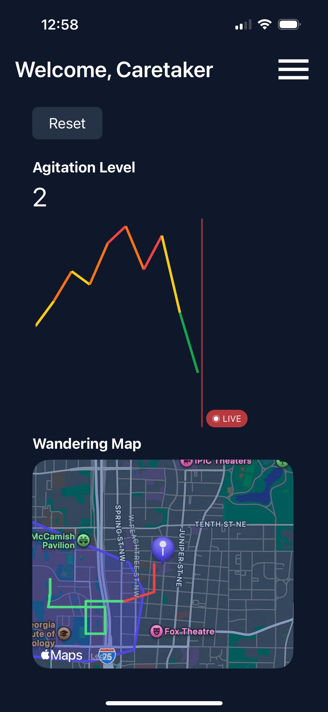
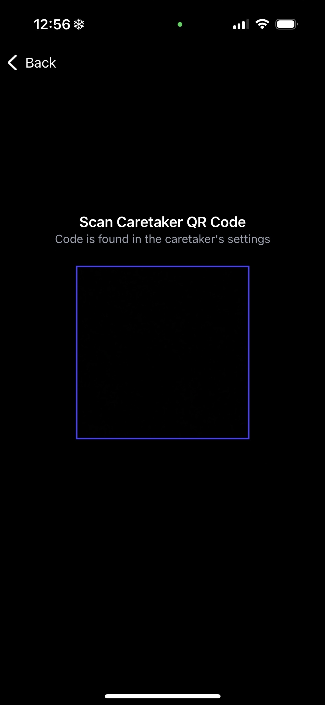

# Dementia Assistance Network (D.A.N.)

> “We want caregivers to feel safe going to get groceries or do their laundry without fear that something might happen to their loved one.”

**D.A.N.** is designed not just to alert but to **act**. It is a proactive dementia management system designed to reduce the burden on caregivers while improving the quality of life for dementia patients. Built using wearable health data from the WHOOP band, it detects agitation and responds in real-time by automatically playing soothing music and alerting the caregiver.

## 📲 Features

- 🔄 Passive agitation tracking using WHOOP wearable data
- 🎵 Music playback to calm patients automatically
- 🔔 Push notifications to alert caregivers in real-time
- 📊 Live charts and maps visualizing agitation levels
- 🔐 Google and WHOOP OAuth flows (custom integration)
- 🧠 ML-ready pipeline to support future multi-device integration

## 📸 Screenshots

   
   
     
   
   
     
   
   

## 🛠️ Tech Stack

| Layer    | Technologies                                                |
| -------- | ----------------------------------------------------------- |
| Frontend | React Native (Expo), TypeScript, NativeWind, Victory Charts |
| Backend  | Python Flask, Firebase Firestore, Firebase Admin SDK        |
| Auth     | Google OAuth 2.0, WHOOP OAuth, Expo AuthSession             |
| Media    | Spotify API, Spotify Playback SDK (WIP), Expo AV            |
| Hosting  | Firebase Functions (WIP), Google Cloud Platform         |

## 🛤️ Roadmap

### ✅ Phase 1 (Completed)
- [x] WHOOP OAuth and webhook integration
- [x] Google OAuth for caregiver authentication
- [x] Caregiver–Patient QR linking flow
- [x] Real-time push notifications for agitation events
- [x] Playback of Spotify music previews on patient device
- [x] Dynamic volume adjustment during playback
- [x] Firebase Firestore data storage
- [x] Agitation charting with Victory
- [x] Agitation mapping
- [x] Emergency alert UI (911, call patient, dismiss)

### 🚧 Phase 2 (In Progress)
- [ ] Full Spotify OAuth integration for premium playback
- [ ] Replace WHOOP stress aggregate with custom ML model
- [ ] Multi-device support: Apple Watch, Fitbit, Samsung Watch
- [ ] Background processes with Expo Background Fetch
- [ ] Resilient offline handling and retry queues
- [ ] Identify a non-premium music service alternative

---

## 🙏 Acknowledgments

- [**WHOOP**](https://www.whoop.com) — for providing open access to biometric health data and webhook infrastructure  
- [**Google Cloud**](https://cloud.google.com) — for enabling secure OAuth, Firestore, and scalable backend services  
- [**Spotify**](https://developer.spotify.com) — for supporting music playback and therapeutic integrations  
- [**Firebase**](https://firebase.google.com) — for seamless authentication and real-time data sync  